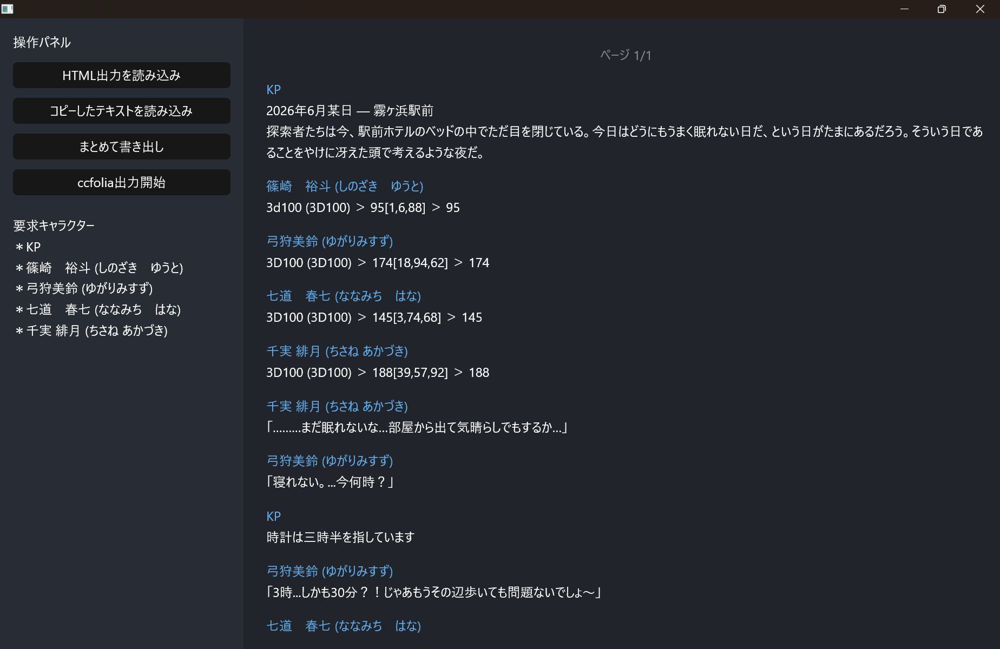

# CcfoliaTweaks
## What's that?


オンライン上でTRPGをするためのプラットフォーム、[ccfolia](https://ccfolia.com/)のログを部屋の管理者がうっかり消してしまった時、各自が保存していたログの断片をツギハギしてログを復元するために作ったツールです。

ダウンロードしたHTMLファイルをブラウザで開き、Ctrl + A、Ctrl + Cしたもの、およびccfoliaの部屋の中でコピーしたログを入力すると内部の整形済みログに蓄積されてゆきます。

結合して.txtファイルとして書き出せるほか、Firefox Marionetteを利用してccfoliaで発言キャラクターを自動選択、自動送信することで部屋のログを復元することができます。（ただし、ログに登場するすべてのキャラクターを所有している必要があります。どのキャラクターを所有している必要があるかはアプリケーション内でリストアップされます）

## インストール
実行には`geckodriver`が必要です。すでにインストールされている場合は一行目は不要です。
```bash
cargo install geckodriver
cargo install --git https://github.com/kinoko0518/CcfoliaTweaks
```
